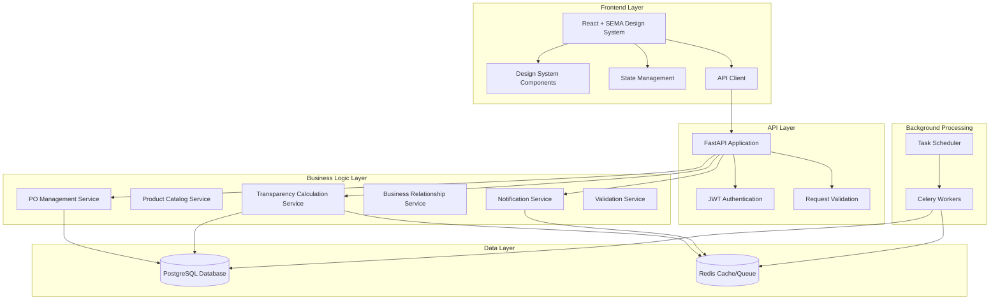

# Design Document

## Overview

The Common backend MVP is a supply chain transparency platform built around a unified Purchase Order (PO) system with a centralized product catalog that prevents "product referentiel chaos." The architecture supports viral adoption through an onboarding cascade model and implements a dual confirmation system that adapts to different company types (processors vs originators). The system features sophisticated business relationship management, real-time transparency calculations using weighted graph traversal algorithms, and comprehensive data sharing controls that balance transparency with commercial sensitivity.

## Architecture

### High-Level Architecture



### Technology Stack

**Backend:**
- **Framework**: FastAPI (Python 3.11+) for high-performance async API
- **Database**: PostgreSQL 15+ with JSONB support for flexible data structures
- **Cache/Queue**: Redis for caching and background job processing
- **Background Jobs**: Celery for async transparency calculations and notifications
- **Authentication**: JWT tokens with secure password hashing
- **Email**: Resend.com API for reliable email delivery

**Frontend:**
- **Framework**: React with TypeScript for type-safe development (matching SEMA design system)
- **Design System**: SEMA Design System components with Tailwind CSS styling
- **State Management**: React Context/Redux for application state
- **API Client**: Axios/Fetch for backend communication with FastAPI
- **Visualization**: D3.js/Chart.js for transparency graphs and supply chain visualization
- **Maps**: Mapbox/Google Maps for geographic coordinate input

**Deployment:**
- **Containerization**: Docker containers for both frontend and backend
- **Hosting**: Railway/Render/Vercel for easy scaling and deployment

## Components and Interfaces

### 1. Authentication & Authorization Component

**Purpose**: Secure user authentication and role-based access control

**Key Features**:
- JWT token-based authentication with configurable expiration
- Role-based permissions (admin, buyer, seller) with company-level isolation
- Invitation-based user onboarding with secure signup links
- Password hashing using industry-standard algorithms

**API Endpoints**:
- `POST /auth/login` - User authentication
- `POST /auth/invite` - Send user invitations
- `POST /auth/signup/{token}` - Complete invitation signup
- `POST /auth/refresh` - Refresh JWT tokens

### 2. Product Catalog Component

**Purpose**: Centralized product management with composition rules to prevent product referentiel chaos

**Key Features**:
- Standardized product definitions with unique common_product_ids (e.g., palm_refined_edible)
- Composition rules defining which products can have material breakdowns with percentage ranges
- Material breakdown schemas specifying allowed input materials and validation rules
- Product categorization (raw_material, processed, finished_good) affecting confirmation interfaces
- HS code integration for trade compliance
- Default units of measurement with conversion support

**API Endpoints**:
- `GET /products` - List available products with filtering by category
- `POST /products` - Create new product (admin only)
- `GET /products/{product_id}` - Get product details with composition rules
- `PUT /products/{product_id}` - Update product specifications (admin only)
- `GET /products/{product_id}/composition-rules` - Get detailed composition validation rules

### 3. Purchase Order Management Component

**Purpose**: Core PO lifecycle management with dual confirmation model

**Key Features**:
- Unified PO creation with unique Common PO IDs
- Status tracking (draft, pending, confirmed, shipped, received)
- Dual confirmation interfaces based on company type and product category
- Input material linking for processors
- Origin data capture for originators
- Composition validation and quantity tracking

**API Endpoints**:
- `POST /purchase-orders` - Create new PO
- `GET /purchase-orders` - List POs with filtering
- `GET /purchase-orders/{po_id}` - Get PO details
- `PUT /purchase-orders/{po_id}/confirm` - Confirm PO (dual interface)
- `POST /purchase-orders/{po_id}/link-inputs` - Link input materials
- `POST /purchase-orders/{po_id}/add-origin` - Add origin data

### 4. Company & Supplier Management Component

**Purpose**: Viral onboarding cascade and sophisticated business relationship management

**Key Features**:
- Company type classification (brand, processor, originator) with role-specific onboarding
- Supplier invitation and onboarding workflow with network effect tracking
- Business relationship establishment with bidirectional visibility permissions
- Data sharing controls distinguishing operational vs commercial sensitive data
- Onboarding chain analytics for viral adoption metrics
- Relationship lifecycle management (establishment, modification, termination)

**API Endpoints**:
- `POST /companies/{company_id}/suppliers` - Add and invite supplier
- `GET /companies/{company_id}/suppliers` - List company suppliers with relationship status
- `PUT /companies/{company_id}/suppliers/{supplier_id}` - Update supplier relationship
- `GET /companies/{company_id}/relationships` - Get all business relationships
- `POST /companies/{company_id}/relationships/{partner_id}/permissions` - Manage data sharing permissions
- `GET /analytics/onboarding-cascade` - Get viral adoption metrics

### 5. Transparency Calculation Component

**Purpose**: Real-time supply chain visibility through sophisticated graph traversal algorithms

**Key Features**:
- Recursive PO graph traversal using formula: Transparency = Σ(Input_Transparency × Quantity_Weight)
- Dual scoring system: Transparency to Mill (TTM) and Transparency to Plantation (TTP)
- Origin data baseline scoring (100% transparency for confirmed origin data)
- Degradation factors for transformation steps (configurable retention percentages)
- Circular reference detection with cycle-breaking algorithms
- Async recalculation triggers with 30-second SLA
- Visual supply chain path generation with confidence levels
- Gap analysis and improvement recommendations
- Partial traceability calculations showing traced vs untraced percentages

**API Endpoints**:
- `GET /transparency/{company_id}` - Get company transparency metrics with TTM/TTP scores
- `GET /transparency/po/{po_id}` - Get PO-specific transparency with supply chain visualization
- `GET /transparency/{company_id}/gaps` - Get traceability gaps and improvement suggestions
- `POST /transparency/recalculate` - Trigger manual recalculation
- `GET /transparency/{company_id}/visual-chain` - Get visual supply chain representation

### 6. Notification Component

**Purpose**: Multi-channel notification system for PO events

**Key Features**:
- In-app and email notification delivery
- User preference management
- Event-driven notification triggers
- Retry logic with exponential backoff
- Notification history and status tracking

**API Endpoints**:
- `GET /notifications` - Get user notifications
- `PUT /notifications/{notification_id}/read` - Mark as read
- `PUT /users/{user_id}/notification-preferences` - Update preferences

## Data Models

### Core Database Schema

#### Companies Table
```sql
CREATE TABLE companies (
    id UUID PRIMARY KEY DEFAULT gen_random_uuid(),
    name VARCHAR(255) NOT NULL,
    company_type VARCHAR(50) NOT NULL, -- 'brand', 'refinery', 'mill', 'plantation', 'trader'
    email VARCHAR(255) UNIQUE NOT NULL,
    
    -- Supply chain specific identifiers (role-based)
    mill_code VARCHAR(100), -- For mills: 'MILL-SUM-001'
    farm_id VARCHAR(100), -- For plantations: 'FARM-KAL-001'
    administrative_area_id VARCHAR(100), -- For mills: 'admin_aceh_01'
    certification_codes JSONB, -- For certified companies: ['cert_rspo_456789', 'cert_ispo_123456']
    
    created_at TIMESTAMPTZ DEFAULT NOW(),
    updated_at TIMESTAMPTZ DEFAULT NOW(),
    
    INDEX idx_companies_type (company_type),
    INDEX idx_companies_mill_code (mill_code),
    INDEX idx_companies_farm_id (farm_id)
);
```

-- **Role Mapping:**
-- Brands: company_type='brand' (LVMH, Brand A)
-- Refineries/Processors: company_type='refinery' (Supplier B)  
-- Mills: company_type='mill' + mill_code + administrative_area_id + certification_codes
-- Plantations: company_type='plantation' + farm_id + certification_codes
-- Traders: company_type='trader'

#### Company Locations Table
```sql
CREATE TABLE company_locations (
    id UUID PRIMARY KEY DEFAULT gen_random_uuid(),
    company_id UUID REFERENCES companies(id) ON DELETE CASCADE,
    location_type VARCHAR(50) NOT NULL, -- 'office', 'facility', 'plantation', 'mill'
    name VARCHAR(255) NOT NULL,
    
    -- Geographic data (precise GPS for plantations/mills)
    latitude DECIMAL(10, 8), -- Required for plantations and mills
    longitude DECIMAL(11, 8), -- Required for plantations and mills
    address TEXT,
    country_code VARCHAR(3),
    
    -- Plantation specific fields
    block_ids JSONB, -- For plantations: ['BLOCK-A-01', 'BLOCK-B-02']
    
    created_at TIMESTAMPTZ DEFAULT NOW(),
    
    INDEX idx_locations_company (company_id),
    INDEX idx_locations_type (location_type),
    INDEX idx_locations_coordinates (latitude, longitude)
);
```

-- **Location Mapping:**
-- Brand offices: location_type='office' (loc_lvmh_paris_01)
-- Processing facilities: location_type='facility' (refineries, mills)
-- Plantation blocks: location_type='plantation' + block_ids + precise GPS
-- Trading offices: location_type='office'

#### Users Table
```sql
CREATE TABLE users (
    id UUID PRIMARY KEY DEFAULT gen_random_uuid(),
    company_id UUID REFERENCES companies(id) ON DELETE CASCADE,
    email VARCHAR(255) UNIQUE NOT NULL,
    password_hash VARCHAR(255) NOT NULL,
    role VARCHAR(50) NOT NULL, -- 'admin', 'buyer', 'seller', 'consultant', 'support'
    
    -- Platform user specific fields
    client_group_id VARCHAR(100), -- For consultants: managing multiple clients
    
    created_at TIMESTAMPTZ DEFAULT NOW(),
    
    INDEX idx_users_company (company_id),
    INDEX idx_users_role (role),
    INDEX idx_users_client_group (client_group_id)
);
```

-- **User Role Mapping:**
-- Platform Administrators: role='admin' (user_admin_01)
-- Consultants: role='consultant' + client_group_id (user_consultant_charlie)
-- Customer Support: role='support' (user_support_01)
-- Company Users: role='buyer'/'seller'/'admin' based on company type

#### Products Table
```sql
CREATE TABLE products (
    id UUID PRIMARY KEY DEFAULT gen_random_uuid(),
    common_product_id VARCHAR(100) UNIQUE NOT NULL, -- 'palm_refined_edible'
    name VARCHAR(255) NOT NULL,
    description TEXT,
    category VARCHAR(100) NOT NULL, -- 'raw_material', 'processed', 'finished_good'
    can_have_composition BOOLEAN DEFAULT FALSE,
    material_breakdown JSONB, -- [{"material": "palm_oil", "min_percentage": 0, "max_percentage": 100, "required": true}]
    default_unit VARCHAR(20) NOT NULL, -- 'KGM', 'MT'
    hs_code VARCHAR(50), -- For trade compliance
    origin_data_requirements JSONB, -- {"coordinates": "required", "certifications": ["RSPO", "NDPE"]}
    created_at TIMESTAMPTZ DEFAULT NOW(),
    updated_at TIMESTAMPTZ DEFAULT NOW(),
    
    INDEX idx_products_category (category),
    INDEX idx_products_common_id (common_product_id),
    INDEX idx_products_hs_code (hs_code)
);
```

#### Palm Oil Product Catalog Seed Data
```sql
-- Seed data for palm oil products with proper HS codes
INSERT INTO products (common_product_id, name, description, category, can_have_composition, material_breakdown, default_unit, hs_code, origin_data_requirements) VALUES

-- Raw Materials
('palm_crude_oil', 'Crude Palm Oil', 'Crude and unrefined palm oil', 'raw_material', false, null, 'MT', '15111000', 
 '{"coordinates": "required", "certifications": ["RSPO"], "harvest_date": "required", "farm_id": "required"}'),

('palm_crude_oil_food', 'Crude Palm Oil (Food Grade)', 'Crude palm oil for food use only', 'raw_material', false, null, 'MT', '15111090',
 '{"coordinates": "required", "certifications": ["RSPO", "NDPE"], "harvest_date": "required", "farm_id": "required"}'),

('palm_nuts_kernels', 'Palm Nuts and Kernels', 'Palm nuts and kernels for oil extraction', 'raw_material', false, null, 'MT', '12071010',
 '{"coordinates": "required", "certifications": ["RSPO"], "harvest_date": "required", "farm_id": "required"}'),

-- Processed Products
('palm_oil_refined', 'Refined Palm Oil (Other than Crude)', 'Palm oil refined or fractions, not chemically modified', 'processed', true, 
 '[{"material": "palm_crude_oil", "min_percentage": 95, "max_percentage": 100, "required": true}]', 'MT', '15119000', null),

('palm_oil_rbd', 'Refined Bleached Deodorised Palm Oil', 'RBD palm oil for food applications', 'processed', true,
 '[{"material": "palm_crude_oil", "min_percentage": 98, "max_percentage": 100, "required": true}]', 'MT', '15119010', null),

('palm_olein_rbd', 'Refined Bleached Deodorised Palmolein', 'RBD palmolein liquid fraction', 'processed', true,
 '[{"material": "palm_crude_oil", "min_percentage": 95, "max_percentage": 100, "required": true}]', 'MT', '15119020', null),

('palm_stearin_rbd', 'Refined Bleached Deodorised Palm Stearin', 'RBD palm stearin solid fraction', 'processed', true,
 '[{"material": "palm_crude_oil", "min_percentage": 95, "max_percentage": 100, "required": true}]', 'MT', '15119030', null),

('palm_oil_fractions_other', 'Other Palm Oil Fractions (Refined)', 'Other refined palm oil fractions, not chemically modified', 'processed', true,
 '[{"material": "palm_crude_oil", "min_percentage": 90, "max_percentage": 100, "required": true}]', 'MT', '15119090', null),

('palm_oil_industrial', 'Palm Oil for Industrial Use', 'Palm oil and liquid fractions for industrial use (non-food)', 'processed', true,
 '[{"material": "palm_crude_oil", "min_percentage": 95, "max_percentage": 100, "required": true}]', 'MT', '15119091', null),

('palm_oil_liquid_fractions', 'Palm Oil Liquid Fractions', 'Palm oil liquid fractions, not chemically modified (non-industrial, non-crude)', 'processed', true,
 '[{"material": "palm_crude_oil", "min_percentage": 95, "max_percentage": 100, "required": true}]', 'MT', '15119099', null),

-- Palm Kernel Products
('palm_kernel_oil', 'Palm Kernel Oil', 'Palm kernel oil and its fractions, refined or unrefined', 'processed', true,
 '[{"material": "palm_nuts_kernels", "min_percentage": 95, "max_percentage": 100, "required": true}]', 'MT', '15132110', null);
```

#### Complete Actor Type Support Mapping

**Supply Chain Actors:**

1. **Brands (LVMH, Brand A)**
   - `companies.company_type = 'brand'`
   - `company_locations` for facilities/offices
   - Product codes via `products` table relationships
   - ✅ **Fully Supported**

2. **Refineries/Processors (Supplier B)**
   - `companies.company_type = 'refinery'`
   - `company_locations` for processing facilities
   - Input/output product codes via `products` relationships
   - `batches.batch_id` for output batches (batch_refined_2023_456)
   - `batches.transformation_id` for transformation events
   - ✅ **Fully Supported**

3. **Mills (Processing Facilities)**
   - `companies.company_type = 'mill'`
   - `companies.mill_code` (MILL-SUM-001)
   - `companies.administrative_area_id` (admin_aceh_01)
   - `companies.certification_codes` (cert_rspo_456789)
   - `company_locations` with precise GPS coordinates
   - ✅ **Fully Supported**

4. **Plantations/Farms**
   - `companies.company_type = 'plantation'`
   - `companies.farm_id` (FARM-KAL-001)
   - `company_locations.block_ids` (BLOCK-A-01)
   - `company_locations` with precise GPS coordinates
   - `batches.batch_id` for harvest batches (HARVEST-2023-10-001)
   - ✅ **Fully Supported**

5. **Intermediate Traders**
   - `companies.company_type = 'trader'`
   - `company_locations` for trading offices
   - `purchase_orders.common_po_id` can be anonymized for privacy
   - ✅ **Fully Supported**

**Platform Actors:**

6. **Platform Administrators**
   - `users.role = 'admin'` (platform level)
   - `platform_config` for product_catalog_version management
   - `platform_config` for validation_rule_set_id management
   - ✅ **Fully Supported**

7. **Consultants (Charlie)**
   - `users.role = 'consultant'`
   - `users.client_group_id` for managing multiple clients
   - `platform_config` for report_template_id management
   - ✅ **Fully Supported**

8. **Customer Support**
   - `users.role = 'support'`
   - `support_tickets.ticket_id` for support requests
   - `support_tickets.manual_process_id` for manual interventions
   - ✅ **Fully Supported**

**Additional Capabilities:**
- **Anonymous POs**: `purchase_orders.common_po_id` can be anonymized for traders
- **Batch Tracking**: Full traceability from harvest to final product
- **Geographic Precision**: Latitude/longitude for mills and plantations
- **Certification Management**: JSONB storage for multiple certifications
- **Multi-location Support**: Companies can have multiple facilities/offices

#### Purchase Orders Table (Core Entity)
```sql
CREATE TABLE purchase_orders (
    id UUID PRIMARY KEY DEFAULT gen_random_uuid(),
    common_po_id VARCHAR(100) UNIQUE NOT NULL, -- 'PO-COMMON-ABC123'
    external_po_id VARCHAR(255), -- Client's internal PO ID
    status VARCHAR(50) NOT NULL, -- 'draft', 'pending', 'confirmed', 'shipped', 'received'
    
    -- Parties
    buyer_company_id UUID REFERENCES companies(id) ON DELETE CASCADE,
    seller_company_id UUID REFERENCES companies(id) ON DELETE CASCADE,
    
    -- Product details
    product_id UUID REFERENCES products(id) ON DELETE CASCADE,
    quantity_ordered DECIMAL(12, 4),
    quantity_confirmed DECIMAL(12, 4),
    unit VARCHAR(20) NOT NULL,
    
    -- Composition (varies per transaction)
    composition JSONB, -- {"palm_oil": 85.5, "palm_kernel_oil": 14.5}
    
    -- Traceability and Batch Management
    input_materials JSONB, -- [{"source_po_id": "PO-123", "quantity_used": 60.0, "batch_id": "batch_crude_2023_123"}]
    output_batch_id VARCHAR(100), -- 'batch_refined_2023_456'
    transformation_id VARCHAR(100), -- For transformation events
    harvest_batch_id VARCHAR(100), -- 'HARVEST-2023-10-001' for plantation origins
    
    -- Origin and Location Data
    origin_data JSONB, -- {"coordinates": {"lat": 1.23, "lng": 103.45}, "certifications": ["cert_rspo_456789"], "harvest_date": "2023-10-15", "farm_id": "FARM-KAL-001", "block_id": "BLOCK-A-01"}
    mill_code VARCHAR(100), -- Reference to mill that processed the material
    administrative_area_id VARCHAR(100), -- For regional risk assessment
    
    -- Transparency Scores (cached for performance)
    transparency_to_mill DECIMAL(5, 4), -- TTM score (0.0000 to 1.0000)
    transparency_to_plantation DECIMAL(5, 4), -- TTP score (0.0000 to 1.0000)
    transparency_calculated_at TIMESTAMPTZ,
    
    -- Timeline
    created_at TIMESTAMPTZ DEFAULT NOW(),
    confirmed_at TIMESTAMPTZ,
    expected_delivery_date DATE,
    
    -- Indexes for performance
    INDEX idx_po_buyer (buyer_company_id),
    INDEX idx_po_seller (seller_company_id),
    INDEX idx_po_status (status),
    INDEX idx_po_product (product_id)
);
```

#### Business Relationships Table
```sql
CREATE TABLE business_relationships (
    id UUID PRIMARY KEY DEFAULT gen_random_uuid(),
    buyer_company_id UUID REFERENCES companies(id) ON DELETE CASCADE,
    seller_company_id UUID REFERENCES companies(id) ON DELETE CASCADE,
    relationship_type VARCHAR(50) NOT NULL, -- 'supplier', 'customer', 'partner'
    status VARCHAR(50) NOT NULL, -- 'pending', 'active', 'suspended', 'terminated'
    data_sharing_permissions JSONB, -- {"operational_data": true, "commercial_data": false, "traceability_data": true}
    invited_by_company_id UUID REFERENCES companies(id), -- For tracking viral cascade
    established_at TIMESTAMPTZ DEFAULT NOW(),
    terminated_at TIMESTAMPTZ,
    
    UNIQUE(buyer_company_id, seller_company_id),
    INDEX idx_relationships_buyer (buyer_company_id),
    INDEX idx_relationships_seller (seller_company_id),
    INDEX idx_relationships_status (status)
);
```

#### Batch Tracking Table
```sql
CREATE TABLE batches (
    id UUID PRIMARY KEY DEFAULT gen_random_uuid(),
    batch_id VARCHAR(100) UNIQUE NOT NULL, -- 'batch_refined_2023_456', 'HARVEST-2023-10-001'
    batch_type VARCHAR(50) NOT NULL, -- 'harvest', 'processing', 'transformation'
    company_id UUID REFERENCES companies(id) ON DELETE CASCADE,
    location_id UUID REFERENCES company_locations(id),
    product_id UUID REFERENCES products(id),
    
    quantity DECIMAL(12, 4),
    unit VARCHAR(20),
    
    -- Batch specific data
    production_date DATE,
    expiry_date DATE,
    quality_metrics JSONB,
    
    -- Transformation tracking
    transformation_id VARCHAR(100), -- For refineries: transformation events
    
    created_at TIMESTAMPTZ DEFAULT NOW(),
    
    INDEX idx_batches_company (company_id),
    INDEX idx_batches_type (batch_type),
    INDEX idx_batches_date (production_date),
    INDEX idx_batches_transformation (transformation_id)
);
```

-- **Batch Mapping:**
-- Refinery output batches: batch_type='processing' + transformation_id
-- Plantation harvest batches: batch_type='harvest' (HARVEST-2023-10-001)
-- Mill processing batches: batch_type='processing'

#### Platform Configuration Table
```sql
CREATE TABLE platform_config (
    id UUID PRIMARY KEY DEFAULT gen_random_uuid(),
    config_key VARCHAR(100) UNIQUE NOT NULL,
    config_value JSONB NOT NULL,
    config_type VARCHAR(50) NOT NULL, -- 'product_catalog_version', 'validation_rule_set', 'report_template'
    version VARCHAR(20),
    created_by UUID REFERENCES users(id),
    created_at TIMESTAMPTZ DEFAULT NOW(),
    
    INDEX idx_config_key (config_key),
    INDEX idx_config_type (config_type)
);
```

-- **Configuration Mapping:**
-- Product catalog versions: config_type='product_catalog_version' (for admins)
-- Validation rule sets: config_type='validation_rule_set' (for business rules)
-- Report templates: config_type='report_template' (for consultants)

#### Support Tickets Table
```sql
CREATE TABLE support_tickets (
    id UUID PRIMARY KEY DEFAULT gen_random_uuid(),
    ticket_id VARCHAR(100) UNIQUE NOT NULL, -- For support requests
    company_id UUID REFERENCES companies(id),
    user_id UUID REFERENCES users(id),
    assigned_to UUID REFERENCES users(id), -- Support user
    
    title VARCHAR(255) NOT NULL,
    description TEXT,
    status VARCHAR(50) NOT NULL, -- 'open', 'in_progress', 'resolved', 'closed'
    priority VARCHAR(20) NOT NULL, -- 'low', 'medium', 'high', 'urgent'
    
    manual_process_id VARCHAR(100), -- For tracking manual interventions
    
    created_at TIMESTAMPTZ DEFAULT NOW(),
    updated_at TIMESTAMPTZ DEFAULT NOW(),
    resolved_at TIMESTAMPTZ,
    
    INDEX idx_tickets_company (company_id),
    INDEX idx_tickets_status (status),
    INDEX idx_tickets_assigned (assigned_to),
    INDEX idx_tickets_manual_process (manual_process_id)
);
```

-- **Support Mapping:**
-- Support tickets: ticket_id (for support requests)
-- Manual processes: manual_process_id (for tracking interventions)

#### Audit Events Table
```sql
CREATE TABLE po_events (
    id UUID PRIMARY KEY DEFAULT gen_random_uuid(),
    po_id UUID REFERENCES purchase_orders(id) ON DELETE CASCADE,
    event_type VARCHAR(100) NOT NULL, -- 'created', 'confirmed', 'composition_updated', 'transparency_calculated'
    actor_company_id UUID REFERENCES companies(id),
    actor_user_id UUID REFERENCES users(id),
    data JSONB NOT NULL, -- Full snapshot of changes
    created_at TIMESTAMPTZ DEFAULT NOW(),
    
    INDEX idx_events_po (po_id),
    INDEX idx_events_type (event_type),
    INDEX idx_events_time (created_at)
);
```

### Business Logic Models

#### Dual Confirmation Model Logic
```python
class ConfirmationInterface:
    @staticmethod
    def determine_interface(seller_company: Company, product: Product) -> str:
        """Determine which confirmation interface to show"""
        if seller_company.company_type == 'originator' or product.category == 'raw_material':
            return 'origin_data_interface'
        elif seller_company.company_type == 'processor' or product.can_have_composition:
            return 'transformation_interface'
        else:
            return 'simple_confirmation_interface'
```

#### Enhanced Transparency Calculation Model
```python
class TransparencyCalculator:
    DEGRADATION_FACTOR = 0.95  # 5% degradation per transformation step
    
    async def calculate_po_transparency(self, po_id: str, visited_pos: set = None) -> TransparencyResult:
        """Recursively calculate transparency through PO graph with cycle detection"""
        if visited_pos is None:
            visited_pos = set()
            
        if po_id in visited_pos:
            # Circular reference detected - break cycle
            return TransparencyResult(po_id=po_id, ttm=0.0, ttp=0.0, is_circular=True)
            
        visited_pos.add(po_id)
        po = await self.get_po_with_inputs(po_id)
        
        if not po.input_materials:
            # Origin point - base case
            ttm_score = 1.0 if po.origin_data else 0.0
            ttp_score = 1.0 if po.origin_data and self._has_plantation_data(po.origin_data) else 0.0
            
            return TransparencyResult(
                po_id=po_id,
                ttm=ttm_score,
                ttp=ttp_score,
                supply_chain_path=[po_id],
                confidence_level=1.0 if po.origin_data else 0.0
            )
        
        # Calculate weighted transparency from inputs
        total_ttm = 0.0
        total_ttp = 0.0
        total_weight = 0.0
        supply_chain_paths = []
        
        for input_material in po.input_materials:
            input_score = await self.calculate_po_transparency(
                input_material['source_po_id'], 
                visited_pos.copy()
            )
            weight = input_material['quantity_used'] / po.quantity_confirmed
            
            total_ttm += input_score.ttm * weight
            total_ttp += input_score.ttp * weight
            total_weight += weight
            supply_chain_paths.extend(input_score.supply_chain_path)
        
        # Apply degradation factor for transformation
        final_ttm = total_ttm * self.DEGRADATION_FACTOR
        final_ttp = total_ttp * self.DEGRADATION_FACTOR
        
        # Calculate confidence level based on data completeness
        confidence = self._calculate_confidence(po, total_weight)
        
        return TransparencyResult(
            po_id=po_id,
            ttm=final_ttm,
            ttp=final_ttp,
            supply_chain_path=[po_id] + supply_chain_paths,
            confidence_level=confidence,
            traced_percentage=total_weight * 100,
            untraced_percentage=(1 - total_weight) * 100
        )
    
    def _has_plantation_data(self, origin_data: dict) -> bool:
        """Check if origin data includes plantation-level information"""
        required_fields = ['coordinates', 'farm_id', 'harvest_date']
        return all(field in origin_data for field in required_fields)
    
    def _calculate_confidence(self, po, total_weight: float) -> float:
        """Calculate confidence level based on data completeness"""
        base_confidence = 0.8 if po.composition else 0.6
        weight_factor = min(total_weight, 1.0)  # Cap at 100%
        return base_confidence * weight_factor
```

#### Business Relationship Management Model
```python
class BusinessRelationshipManager:
    async def establish_relationship(self, buyer_id: str, seller_id: str, 
                                   invited_by: str = None) -> BusinessRelationship:
        """Establish business relationship with default permissions"""
        default_permissions = {
            "operational_data": True,  # Quantities, dates, status
            "commercial_data": False,  # Prices, margins, terms
            "traceability_data": True  # Input materials, origin data
        }
        
        relationship = BusinessRelationship(
            buyer_company_id=buyer_id,
            seller_company_id=seller_id,
            relationship_type='supplier',
            status='active',
            data_sharing_permissions=default_permissions,
            invited_by_company_id=invited_by
        )
        
        await self.save_relationship(relationship)
        await self.track_viral_cascade(invited_by, seller_id)
        return relationship
    
    async def can_access_po_data(self, requesting_company_id: str, 
                                po: PurchaseOrder, data_type: str) -> bool:
        """Check if company can access specific PO data based on relationships"""
        if po.buyer_company_id == requesting_company_id or po.seller_company_id == requesting_company_id:
            return True  # Direct party access
            
        # Check relationship permissions
        relationship = await self.get_relationship(requesting_company_id, po.seller_company_id)
        if not relationship:
            return False
            
        return relationship.data_sharing_permissions.get(data_type, False)
```

## Error Handling

### Error Response Format
```json
{
    "error": {
        "code": "VALIDATION_ERROR",
        "message": "Composition percentages exceed 100%",
        "details": {
            "field": "composition",
            "provided_total": 105.5,
            "maximum_allowed": 100.0
        },
        "timestamp": "2023-12-01T10:30:00Z"
    }
}
```

### Error Categories

1. **Validation Errors** (400)
   - Invalid composition percentages
   - Missing required fields
   - Invalid product selections
   - Insufficient input material quantities

2. **Authorization Errors** (401/403)
   - Invalid JWT tokens
   - Insufficient permissions for company data
   - Cross-company access violations

3. **Business Logic Errors** (422)
   - Cannot link inputs to non-processor company
   - Cannot confirm already confirmed PO
   - Circular reference in PO graph

4. **System Errors** (500)
   - Database connection failures
   - Background job processing errors
   - External service unavailability

### Error Handling Strategy

- **Graceful Degradation**: System continues operating with reduced functionality
- **Retry Logic**: Automatic retries for transient failures with exponential backoff
- **Circuit Breaker**: Prevent cascade failures in external service calls
- **Comprehensive Logging**: Structured logging for debugging and monitoring

## Testing Strategy

### Unit Testing
- **Service Layer Tests**: Business logic validation and edge cases
- **Model Tests**: Data validation and relationship integrity
- **Utility Tests**: Helper functions and algorithms
- **Coverage Target**: 90%+ code coverage

### Integration Testing
- **API Endpoint Tests**: Full request/response cycle testing
- **Database Integration**: Transaction handling and data consistency
- **Background Job Tests**: Async processing verification
- **Authentication Flow Tests**: JWT token lifecycle

### End-to-End Testing
- **User Journey Tests**: Complete workflows from PO creation to confirmation
- **Transparency Calculation Tests**: Complex PO graph scenarios
- **Notification Flow Tests**: Multi-channel notification delivery
- **Onboarding Cascade Tests**: Viral supplier invitation workflows

### Performance Testing
- **Load Testing**: API performance under concurrent users
- **Transparency Calculation Performance**: Large PO graph traversal
- **Database Query Optimization**: Index effectiveness and query performance
- **Background Job Processing**: Queue throughput and processing times

### Test Data Strategy
- **Seed Data**: Realistic test companies, products, and PO relationships
- **Graph Scenarios**: Various PO chain configurations for transparency testing
- **Edge Cases**: Circular references, missing data, and error conditions

This design provides a robust, scalable foundation for the Common platform that addresses all requirements while maintaining flexibility for future enhancements. The dual confirmation model, viral onboarding cascade, and real-time transparency calculations are the core innovations that differentiate Common from traditional supply chain solutions.