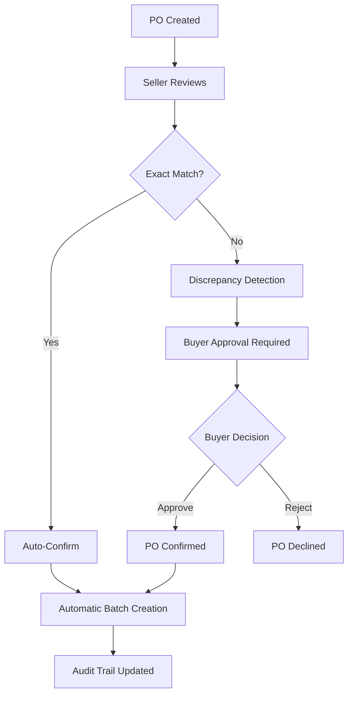

# Purchase Order & Inventory Architecture

## Overview

This document describes the architectural transformation from "algorithmic guessing" to "collaborative truth establishment" in the purchase order and inventory management system.

## Core Philosophy: From Guessing to Collaborating

### Before: The Guessing Problem
```
Buyer: "I need 2000 kg"
Seller: "I can provide 1950 kg" → System overwrites → Truth is lost
```

### After: Collaborative Truth
```
Buyer: "I need 2000 kg"
Seller: "I can provide 1950 kg from these specific batches"
System: "Discrepancy detected - buyer approval required"
Buyer: "Approved - create batch with confirmed quantity"
System: "Batch PO-LOREAL-003-BATCH-1 created with full audit trail"
```

---

## System Architecture

### 1. Purchase Order Lifecycle



### 2. Data Flow Architecture

```
┌─────────────────┐    ┌─────────────────┐    ┌─────────────────┐
│   Frontend UI   │    │   Backend API   │    │   Database      │
│                 │    │                 │    │                 │
│ ┌─────────────┐ │    │ ┌─────────────┐ │    │ ┌─────────────┐ │
│ │ Inventory   │ │◄──►│ │ Discrepancy │ │◄──►│ │ PO Tables   │ │
│ │ Selector    │ │    │ │ Detection   │ │    │ │             │ │
│ └─────────────┘ │    │ └─────────────┘ │    │ └─────────────┘ │
│                 │    │                 │    │                 │
│ ┌─────────────┐ │    │ ┌─────────────┐ │    │ ┌─────────────┐ │
│ │ Validation  │ │◄──►│ │ Batch       │ │◄──►│ │ Batch       │ │
│ │ Display     │ │    │ │ Creation    │ │    │ │ Tables      │ │
│ └─────────────┘ │    │ └─────────────┘ │    │ └─────────────┘ │
│                 │    │                 │    │                 │
│ ┌─────────────┐ │    │ ┌─────────────┐ │    │ ┌─────────────┐ │
│ │ Approval    │ │◄──►│ │ History     │ │◄──►│ │ Audit       │ │
│ │ Workflow    │ │    │ │ Logging     │ │    │ │ Tables      │ │
│ └─────────────┘ │    │ └─────────────┘ │    │ └─────────────┘ │
└─────────────────┘    └─────────────────┘    └─────────────────┘
```

---

## Key Components

### 1. Discrepancy Detection Service

**Purpose**: Automatically detects differences between original and confirmed PO values.

**Algorithm**:
```python
def detect_discrepancies(original_po, seller_confirmation):
    discrepancies = []
    
    # Quantity discrepancy
    if abs(original_po.quantity - seller_confirmation.confirmed_quantity) > TOLERANCE:
        discrepancies.append({
            'field': 'quantity',
            'original': original_po.quantity,
            'confirmed': seller_confirmation.confirmed_quantity,
            'difference': seller_confirmation.confirmed_quantity - original_po.quantity,
            'percentage_change': ((seller_confirmation.confirmed_quantity - original_po.quantity) / original_po.quantity) * 100
        })
    
    # Price discrepancy
    if abs(original_po.unit_price - seller_confirmation.confirmed_unit_price) > PRICE_TOLERANCE:
        discrepancies.append({
            'field': 'unit_price',
            'original': original_po.unit_price,
            'confirmed': seller_confirmation.confirmed_unit_price,
            'difference': seller_confirmation.confirmed_unit_price - original_po.unit_price
        })
    
    return discrepancies
```

**Tolerance Configuration**:
- Quantity: 0.001 kg (1 gram)
- Price: $0.01 per unit
- Date: 0 days (exact match required)

### 2. Automatic Batch Creation

**Purpose**: Materializes confirmed POs into trackable batches with deterministic IDs.

**Implementation**:
```python
def _confirm_po(po: PurchaseOrder, confirmation: SellerConfirmation, db: Session):
    # 1. Update PO status
    po.status = PurchaseOrderStatus.CONFIRMED
    po.confirmed_quantity = confirmation.confirmed_quantity
    po.confirmed_unit_price = confirmation.confirmed_unit_price
    
    # 2. Create deterministic batch ID
    batch_id = f"PO-{po.po_number}-BATCH-1"
    
    # 3. Create batch with PO linkage
    batch = Batch(
        batch_id=batch_id,
        quantity=confirmation.confirmed_quantity,  # Use CONFIRMED quantity
        company_id=po.seller_company_id,
        product_id=po.product_id,
        source_purchase_order_id=po.id,  # CRITICAL: Link back to PO
        batch_metadata={
            "created_from_po": True,
            "purchase_order_id": str(po.id),
            "auto_created": True
        }
    )
    
    # 4. Log history
    history_service.log_po_confirmed(po.id, confirmation)
    history_service.log_batch_created(batch.batch_id, po.id)
    
    return batch
```

### 3. Inventory Selection System

**Purpose**: Provides warehouse-like interface for selecting actual inventory.

**FIFO Algorithm**:
```python
def auto_allocate_fifo(available_batches, target_quantity):
    """
    Allocates batches using First In, First Out strategy
    """
    # Sort by expiry date (nulls last)
    sorted_batches = sorted(
        available_batches,
        key=lambda b: b.expiry_date or date.max
    )
    
    allocations = []
    remaining = target_quantity
    
    for batch in sorted_batches:
        if remaining <= 0:
            break
            
        quantity_to_use = min(remaining, batch.quantity)
        allocations.append({
            'batch_id': batch.id,
            'quantity_to_use': quantity_to_use,
            'fifo_priority': len(allocations) + 1
        })
        remaining -= quantity_to_use
    
    return allocations
```

---

## Database Schema Design

### 1. Purchase Orders Table

```sql
-- Enhanced PO table with approval workflow
ALTER TABLE purchase_orders ADD COLUMN (
    status ENUM('issued', 'awaiting_buyer_approval', 'confirmed', 'declined') DEFAULT 'issued',
    buyer_approved_at TIMESTAMP NULL,
    buyer_approval_user_id UUID REFERENCES users(id),
    discrepancy_reason TEXT,
    seller_confirmed_data JSONB,
    
    -- Original values preservation
    original_quantity DECIMAL(15,3),
    original_unit_price DECIMAL(10,2),
    original_delivery_date DATE,
    original_delivery_location TEXT
);
```

### 2. Batches Table

```sql
-- Enhanced batch table with PO linkage
ALTER TABLE batches ADD COLUMN (
    source_purchase_order_id UUID REFERENCES purchase_orders(id),
    
    -- Indexes for performance
    INDEX idx_batches_source_po (source_purchase_order_id),
    INDEX idx_batches_inventory (company_id, quantity, expiry_date) WHERE quantity > 0
);
```

### 3. Audit Trail Table

```sql
-- Complete audit trail for PO actions
CREATE TABLE purchase_order_history (
    id UUID PRIMARY KEY DEFAULT gen_random_uuid(),
    purchase_order_id UUID NOT NULL REFERENCES purchase_orders(id),
    action VARCHAR(50) NOT NULL,
    user_id UUID REFERENCES users(id),
    timestamp TIMESTAMP DEFAULT CURRENT_TIMESTAMP,
    details JSONB,
    
    INDEX idx_po_history_po_id (purchase_order_id),
    INDEX idx_po_history_timestamp (timestamp)
);
```

---

## API Design Patterns

### 1. RESTful Resource Design

```
GET    /api/v1/purchase-orders/{id}                    # Get PO details
POST   /api/v1/purchase-orders/{id}/seller-confirm     # Seller confirmation
POST   /api/v1/purchase-orders/{id}/buyer-approve      # Buyer approval
GET    /api/v1/purchase-orders/{id}/discrepancies      # Get discrepancies
GET    /api/v1/purchase-orders/{id}/history            # Get audit trail

GET    /api/v1/batches/companies/{id}/inventory        # Get inventory
GET    /api/v1/batches/by-purchase-order/{id}          # Get PO batches
```

### 2. Response Patterns

**Success Response**:
```json
{
  "status": "success",
  "data": { /* resource data */ },
  "meta": {
    "timestamp": "2025-01-09T10:30:00Z",
    "request_id": "req-123"
  }
}
```

**Error Response**:
```json
{
  "status": "error",
  "error": {
    "code": "VALIDATION_ERROR",
    "message": "Invalid request data",
    "details": {
      "confirmed_quantity": "Must be greater than 0"
    }
  },
  "meta": {
    "timestamp": "2025-01-09T10:30:00Z",
    "request_id": "req-123"
  }
}
```

---

## Security Architecture

### 1. Authentication & Authorization

```python
# Role-based access control
@require_role(['seller'])
def seller_confirm_po(po_id, confirmation_data):
    # Only sellers can confirm POs
    pass

@require_role(['buyer'])
def buyer_approve_po(po_id, approval_data):
    # Only buyers can approve discrepancies
    pass

@require_company_access
def get_company_inventory(company_id):
    # Users can only access their own company's inventory
    pass
```

### 2. Data Validation

```python
# Comprehensive input validation
class SellerConfirmationSchema(BaseModel):
    confirmed_quantity: Decimal = Field(gt=0, max_digits=15, decimal_places=3)
    confirmed_unit_price: Optional[Decimal] = Field(gt=0, max_digits=10, decimal_places=2)
    confirmed_delivery_date: Optional[date]
    seller_notes: Optional[str] = Field(max_length=1000)
    selected_batches: List[BatchSelectionSchema] = Field(default_factory=list)
```

---

## Performance Considerations

### 1. Database Optimization

- **Indexes**: Strategic indexes on frequently queried fields
- **Query Optimization**: Efficient joins and filtering
- **Connection Pooling**: Managed database connections
- **Caching**: Redis caching for frequently accessed data

### 2. API Performance

- **Pagination**: Large result sets are paginated
- **Field Selection**: Only return requested fields
- **Compression**: Gzip compression for responses
- **Rate Limiting**: Prevent API abuse

### 3. Frontend Optimization

- **Component Memoization**: Prevent unnecessary re-renders
- **Lazy Loading**: Load components on demand
- **State Management**: Efficient state updates
- **Bundle Optimization**: Code splitting and tree shaking

---

## Monitoring & Observability

### 1. Metrics

- **PO Confirmation Rate**: Percentage of POs confirmed vs. requiring approval
- **Discrepancy Frequency**: How often discrepancies occur
- **Batch Utilization**: Efficiency of inventory allocation
- **API Response Times**: Performance monitoring

### 2. Logging

```python
# Structured logging for audit trail
logger.info(
    "Purchase order confirmed",
    po_id=po.id,
    seller_company_id=po.seller_company_id,
    buyer_company_id=po.buyer_company_id,
    confirmed_quantity=confirmation.confirmed_quantity,
    discrepancies_detected=len(discrepancies),
    batch_created=batch.batch_id
)
```

### 3. Error Tracking

- **Sentry Integration**: Automatic error reporting
- **Health Checks**: System health monitoring
- **Alerting**: Notifications for critical issues

---

## Future Enhancements

### 1. Machine Learning Integration

- **Demand Forecasting**: Predict inventory needs
- **Price Optimization**: Suggest optimal pricing
- **Quality Prediction**: Predict batch quality metrics

### 2. Advanced Workflows

- **Multi-batch POs**: Support for multiple batches per PO
- **Partial Confirmations**: Allow partial quantity confirmations
- **Automated Approvals**: Auto-approve minor discrepancies

### 3. Integration Capabilities

- **ERP Integration**: Connect with external ERP systems
- **IoT Integration**: Real-time inventory tracking
- **Blockchain**: Immutable audit trails
